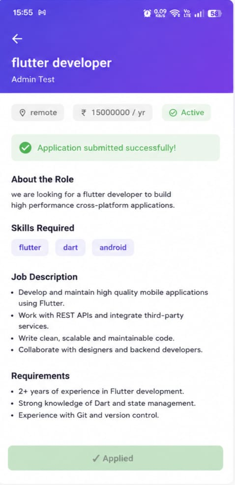
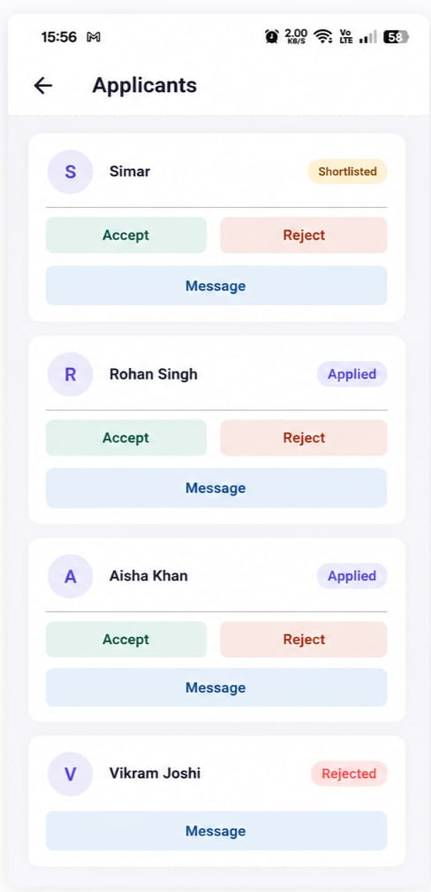
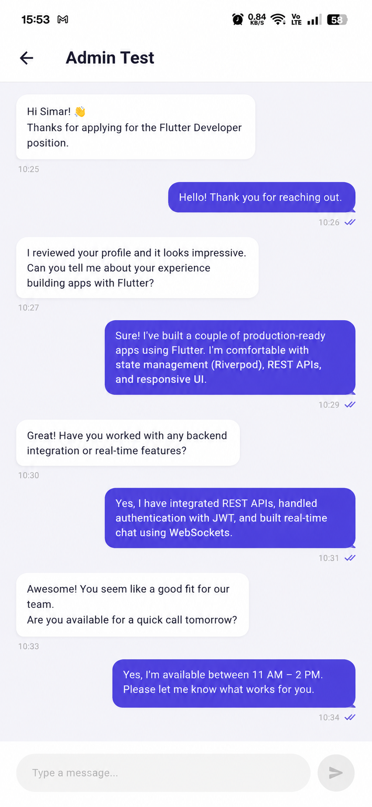

# Job Hub — Frontend

Flutter frontend for **Job Hub**, a full-stack job portal that connects candidates and recruiters through job listings, applications, applicant management, and recruiter-candidate messaging.

Backend (API) repo: [JOB_HUB_BACKEND](https://github.com/SimarSingh2004/JOB_HUB_BACKEND)

## Download

📱 **[Download the APK](https://github.com/SimarSingh2004/JOB_HUB_FRONTEND/releases/tag/v1.0.0-Initial_Release)**

The release APK connects to the deployed Job Hub backend and can be used to explore the complete candidate and recruiter workflows.

## Screenshots

## Screenshots

<table>
  <tr>
    <td align="center"><b>Job Detail</b></td>
    <td align="center"><b>Applicants</b></td>
    <td align="center"><b>Chat</b></td>
  </tr>
  <tr>
    <td>
      
    </td>
    <td>
      
    </td>
    <td>
      
    </td>
  </tr>
</table>
---

## Table of Contents

- [Tech Stack](#tech-stack)
- [Features](#features)
- [State Management Notes](#state-management-notes)
- [Project Structure](#project-structure)
- [Local Setup](#local-setup)
- [Building a Release APK](#building-a-release-apk)

---

## Tech Stack

| Purpose              | Package                                                             |
| -------------------- | ------------------------------------------------------------------- |
| State management     | `flutter_riverpod`                                                  |
| Navigation           | `go_router`                                                         |
| HTTP client          | `dio`, with a custom auth interceptor                               |
| Secure token storage | `flutter_secure_storage`                                            |
| Data models          | `freezed` + `json_serializable` (immutable, generated JSON parsing) |

## Features

**Candidate**

- Browse and search jobs, filter by location, salary range, and skills
- View job details, including whether they've already applied
- Apply to jobs; duplicate applies are blocked with a clear message
- Track application status: Applied, Shortlisted, Accepted, Rejected, or Expired when the associated job is no longer active.
- Chat with a recruiter once shortlisted for one of their jobs
- Manage their own candidate profile

**Recruiter**

- Post, edit, and delete job listings
- Review applicants per job, with candidate details
- Shortlist, accept, or reject applicants
- Message a shortlisted candidate directly
- Manage their own recruiter profile

**Shared**

- Persistent login via securely stored tokens
- Automatic access-token refresh on expiry, transparent to the user
- Clean session isolation — logging out and a different user logging back in never shows leftover data from the previous session

## State Management Notes

The app uses Riverpod's `Notifier`/`AsyncNotifier` pattern throughout, one view-model per feature (`profile_viewmodel.dart`, `jobs_viewmodel.dart`, etc.). A few conventions worth knowing if extending this:

- **Screen-scoped providers use `.autoDispose`** (profile, applications, chat, conversations, job detail, applicants). These hold data specific to the logged-in user or a specific screen — `autoDispose` ensures the provider is torn down the moment its screen is no longer being watched (e.g. navigating away, or logging out), so a freshly logged-in user never inherits state left behind by the previous session.
- **`jobsViewModelProvider` (the public job browse/search list) is intentionally _not_ `autoDispose`** — it holds active search/filter state and shows public, non-user-specific data, so preserving it across tab switches is a UX win with no privacy tradeoff.
- **`job_detail_viewmodel.dart` and `applicants_viewmodel.dart` are `Family` providers**, keyed by `jobId` — each job gets its own cached state.
- **The Dio auth interceptor** (`core/network/dio_client.dart`) automatically retries a request once after refreshing an expired access token, de-duplicates concurrent refresh attempts into a single in-flight `Future`, and tracks a session "epoch" so a refresh that was already in-flight when a user logs out can't clobber a subsequent user's freshly-saved tokens.

## Project Structure

```
lib/
├── core/
│   ├── network/          # DioClient + auth interceptor (token attach, refresh, retry)
│   ├── storage/          # SecureStorage wrapper over flutter_secure_storage
│   ├── errors/           # AppException — normalized error type from Dio failures
│   └── constants/        # API base URL (via --dart-define)
├── models/                # Freezed data models: User, Job, Application, Conversation, Message
├── router/                # go_router route table + auth-aware shell
└── features/
    ├── auth/               # Login, register, session state
    ├── profile/            # Candidate & recruiter profile forms
    ├── jobs/               # Browse, detail, post, my-jobs
    ├── applications/       # Apply, my-applications, applicants (recruiter view)
    └── chat/               # Conversations list, chat screen
```

Each feature folder follows the same `data/` (repository + remote datasource) → `presentation/viewmodels/` → `presentation/screens/` + `presentation/widgets/` layering.

## Local Setup

**Prerequisites:** Flutter SDK, Android emulator or physical device

```bash
git clone https://github.com/SimarSingh2004/JOB_HUB_FRONTEND.git
cd JOB_HUB_FRONTEND
flutter pub get
```

Run against a local backend (Android emulator — `10.0.2.2` is the emulator's alias for your machine's `localhost`):

```bash
flutter run --dart-define=API_BASE_URL=http://10.0.2.2:8000/api/v1
```

Run against the deployed backend:

```bash
flutter run --dart-define=API_BASE_URL=https://jobhubbackend-production-fb43.up.railway.app/api/v1
```

The API base URL is read via `--dart-define` (`lib/core/constants/api_constants.dart`), set at build/run time rather than hardcoded — so switching between local and deployed backends never requires a code change.

## Building a Release APK

```bash
flutter build apk --release --dart-define=API_BASE_URL=https://jobhubbackend-production-fb43.up.railway.app/api/v1
```

Output: `build/app/outputs/flutter-apk/app-release.apk`
